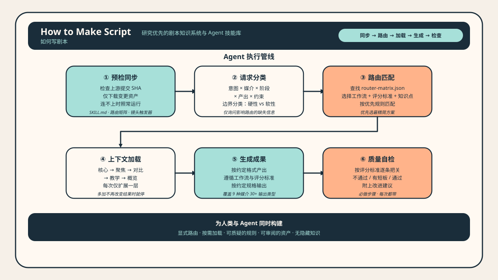

<h1 align="center">How to Make Script（如何写剧本）</h1>

<p align="center">
  开源剧本研发基础设施，面向编剧与 AI Agent。<br/>
  路由分派、内容生成、质量审查、流程编排——覆盖叙事、商业和互动剧本。
</p>

<p align="center">
  <a href="https://github.com/XucroYuri/how-to-make-script/actions/workflows/ci.yml">
    
  </a>
  <a href="./LICENSE">
    
  </a>
  <a href="https://github.com/XucroYuri/how-to-make-script/discussions">
    
  </a>
  <a href="./CONTRIBUTING.md">
    
  </a>
  <a href="./README.md">
    
  </a>
  <a href="./README_zh.md">
    
  </a>
</p>

> 这不是提示词模板仓库，不是唯一真理式教学，也不是 UI-first 产品。
> 它是一套可持续积累的剧本研发基础设施：按需匹配的知识资产、清晰的工作流合约、可复用的审查逻辑、社区驱动的纠偏闭环。

---

## 30 秒看懂它怎么工作

**你给它的请求**

```text
把这个想法做成电影节拍表（`beat_sheet`）：
"一个多年逃避父亲死亡真相的女记者，被迫回到矿区家乡调查旧案。"
```

**系统选择的路径** → [`skill.structure-beat`](./skills/structure-beat/SKILL.md) + [`wp.structure-beat-outline`](./knowledge/20-workflows/wp-structure-beat-outline.md)

**产物片段**

```text
## Beat List
- Opening imbalance: 她在外地做调查记者，却始终回避任何与矿区有关的报道。
- Lock-in: 一页父亲旧案残档逼她回乡。
- Midpoint turn: 她发现自己当年的沉默也是掩盖的一部分。
```

完整链路：[请求](./examples/golden/feature-drama/request.md) · [产物](./examples/golden/feature-drama/artifact.md) · [更多示例](./examples/agent/quickstart.json)

---

## 这是什么

这个仓库不是提示词合集，也不是单一路径的写作课程。它是一套可组合的剧本基础设施——人能用，AI Agent（人工智能代理）也能用。

它把你的请求按「意图 × 媒介 × 阶段 × 产出」分类，只加载相关的知识包——工作流协议、评分标准、参考原子——然后产出结构化的成果，出来之前先自检一遍。你提反驳，它就把你的反馈沉淀为下一次迭代的更好资产。

如果你是编剧：它是一套结构化的创作和诊断工具。如果你在开发 Agent 工作流：它是显式的路由逻辑、受控加载策略、可机器校验的合约。

---

## 怎么运转

<p align="center">
  
</p>


---

## 安装 & 使用

```bash
git clone https://github.com/XucroYuri/how-to-make-script.git ~/.local/share/how-to-make-script
# 后续更新：
git -C ~/.local/share/how-to-make-script pull --ff-only
```

<details>
<summary>Claude Code</summary>

```bash
mkdir -p ~/.claude/skills
ln -sfn ~/.local/share/how-to-make-script ~/.claude/skills/how-to-make-script
```
</details>

<details>
<summary>Codex</summary>

```toml
[[skills.config]]
path = "/Users/<you>/.local/share/how-to-make-script"
enabled = true
```
</details>

其他平台（Gemini CLI、OpenCode、OpenClaw）同理——克隆到本地，让工具指向这个目录。Agent 入口见 [`SKILL.md`](./SKILL.md)。

---

## 仓库规模

| 模块 | 数量 |
| --- | --- |
| 子技能 | 29 个（[`skills/`](./skills)） |
| 输出类型 | 30 种（[`supported-outputs.md`](./references/supported-outputs.md)） |
| 知识原子 | 114 个（[`knowledge/`](./knowledge)） |
| 工作流协议 | 33 个（[`knowledge/20-workflows/`](./knowledge/20-workflows)） |
| 评分标准 | 31 个（[`knowledge/60-rubrics/`](./knowledge/60-rubrics)） |
| 路由夹具 | 119 条（[`fixtures.json`](./examples/agent/fixtures.json)） |
| 知识库 .md | 189 份（[`knowledge/`](./knowledge)） |
| 校验脚本 | 19 个（[`scripts/`](./scripts)） |
| 测试模块 | 19 个（[`tests/`](./tests)） |
| Golden 示例 | 10 组（[`examples/golden/`](./examples/golden)） |
| 参考包 | 10 个（[`examples/reference-packs/`](./examples/reference-packs)） |
| 双语文档 | 17 对（[`docs/`](./docs)） |

**创作与开发** — 一句话梗概（`logline`）、核心前提（`premise`）、节拍表（`beat_sheet`）、大纲（`outline`）、场景草稿（`scene_draft`）、完整剧本（`screenplay_draft`）、对白打磨（`dialogue_polish`）

**诊断与纠偏** — 改稿诊断（`rewrite_report`）、质量把关（`quality_gate_report`）、范围修正（`scope_correction`）、边界映射（`boundary_map`）

**平台专用** — 广告脚本（`commercial_script`）、品牌微电影脚本（`branded_film_script`）、互动分支地图（`interactive_branch_map`）

**表达与下游对接** — 声音风格指南（`voice_style_guide`）、视觉语言包（`visual_language_pack`）、剧本到视频桥接文件（`screen_to_video_brief`）

**团队与系统** — 团队工作流蓝图（`team_workflow_blueprint`）、专家子代理阵容（`expert_subagent_cast`）、交接协议

---

## 下一步看什么

**编剧/策划** — [Golden 示例](./examples/golden) · [支持的输出类型](./references/supported-outputs.md) · [叙事参考包](./examples/reference-packs/narrative-pattern-pack.md) · [自适应质检](./docs/adaptive-quality-checking-zh.md)

**Agent 开发者** — [`SKILL.md`](./SKILL.md)（根编排入口） · [路由矩阵](./references/router-matrix.json) · [路由策略](./references/routing-policy.md) · [上下文加载策略](./docs/context-loading-policy-zh.md) · [内容模型](./docs/content-model-zh.md)

**贡献者** — [贡献说明](./CONTRIBUTING.md) · [支持入口](./SUPPORT.md) · [变更日志](./CHANGELOG.md)

---

## 社区与现状

这个项目通过高质量反驳来成长。

| 渠道 | 用途 |
| --- | --- |
| [Discussions](https://github.com/XucroYuri/how-to-make-script/discussions) | 问题澄清、开放反驳、替代路径、field note |
| [Issues](./.github/ISSUE_TEMPLATE) | 能指出具体路由（`route`）、评估标准（`rubric`）或资产的改动 |
| [Security](./SECURITY.md) | 私密安全问题 |

**当前状态：** 可用的研究优先（`research-first`）剧本仓库。路由、加载和质量把关基础设施成熟。叙事/商业/互动覆盖面广。

**明显不足：** 实时运行时（`runtime execution`）尚未实现。知识束规划（`bundle-planner`）未完善。边缘用例的夹具深度不均。部分类型和阶段知识仍薄。社区讨论到资产沉淀的链路仍靠人工。

适合先做的贡献：挑战一个适用范围过宽的判断、补充一个反例、改进一个文档入口、把一次路径匹配失败（`route mismatch`）记录为夹具。

---

## 仓库标准与元信息

[贡献说明](./CONTRIBUTING.md) · [行为准则](./CODE_OF_CONDUCT.md) · [支持入口](./SUPPORT.md) · [安全问题](./SECURITY.md) · [引用格式](./CITATION.cff) · [许可证](./LICENSE)


